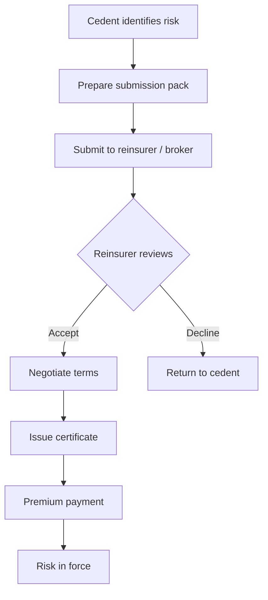

# 15.2 — Facultative Reinsurance

> **Learning Objectives**
>
> After completing this chapter you should be able to:
>
> 1. Define facultative reinsurance and explain when it is used.
> 2. Describe the facultative placement process.
> 3. Distinguish facultative from treaty reinsurance.
> 4. Identify the advantages, disadvantages, and underwriting considerations.

<!-- Metadata (for RAG / AI knowledge base)
keywords: facultative, reinsurance, placement, cession, slip
tags: reinsurance, facultative
categories: volume-15
related: volume-05, volume-15-01
-->

## Executive Summary

Facultative reinsurance is purchased for an individual risk on a case-by-case basis. Each facultative session is separately underwritten, priced, and documented. It is used to provide capacity above treaty limits, cover specialised risks, and manage unusual exposures that fall outside an automatic treaty.

---

## 15.2.1 What Is Facultative Reinsurance?

**Facultative reinsurance** is a single-risk reinsurance arrangement under which the reinsurer has the "faculty" (option) to accept or decline each individual risk submitted. The ceding company likewise has no obligation to cede.

| Feature | Description |
|---------|-------------|
| Object | Individual risk / single policy |
| Submission | Case by case |
| Underwriting | Full individual risk assessment |
| Documentation | Facultative certificate / slip |
| Premium | Negotiated per risk |
| Duration | Policy period of the underlying risk |

---

## 15.2.2 When Is Facultative Used?

| Scenario | Example |
|----------|---------|
| **Capacity above treaty** | Policy limit exceeds automatic treaty capacity |
| **Specialised risks** | Satellite, aviation hull, large industrial works |
| **New / unusual risks** | Emerging risks with no rating history |
| **Adverse experience** | Poor loss history requiring individual scrutiny |
| **Portfolio shaping** | Exclude specific risks from a treaty |
| **Pre-reinsurance** | Secure cover before entering a binding treaty |
| **Non-treaty classes** | Risks not covered by existing treaties |

### Facultative vs Treaty

| Aspect | Facultative | Treaty |
|--------|-------------|--------|
| Coverage | Individual risk | Portfolio / class of business |
| Underwriting | Each risk separately | Program level |
| Obligation | Optional both sides | Automatic within terms |
| Documentation | Certificate per risk | One treaty agreement |
| Administration | Per-risk documentation | Program level reporting |
| Cost | Higher per-risk expense | Lower expense per risk |
| Speed | Slower — negotiation | Faster — automatic |
| Certainty | Not guaranteed | Guaranteed within scope |

---

## 15.2.3 The Facultative Placement Process

### Submission Pack Contents

| Document | Purpose |
|----------|---------|
| Completed risk proposal | Key risk facts |
| Underlying policy wording | Coverage to be reinsured |
| Loss history | Past claims experience |
| Financial information | Insured's stability |
| Survey / inspection report | Physical risk condition |
| Photos / maps | Site information |
| Valuation evidence | Sum insured basis |
| Treaty details | Existing coverage and exclusions |

### Slip / Certificate Key Fields

| Field | Description |
|-------|-------------|
| Reinsured name | Ceding company |
| Original insured | Underlying policyholder |
| Period | Underlying policy period |
| Interest | Risk / subject matter |
| Situation | Location of risk |
| Valuation | Sum insured and basis |
| Limits | Reinsurer's share and limits |
| Premium | Rate and amount |
| Conditions | Facultative conditions and follow-the-fortunes wording |

---

## 15.2.4 Underwriting the Facultative Risk

### Key Underwriting Factors

| Factor | Assessment |
|--------|------------|
| **PML / MFL** | Probable maximum loss / maximum foreseeable loss |
| **Sum insured** | Adequate and not inflated |
| **Construction & occupancy** | Property risk characteristics |
| **Protection** | Sprinklers, alarms, security |
| **Exposure** | Natural perils, accumulation, third-party |
| **Loss history** | Frequency, severity, trends |
| **Management** | Risk attitude and loss control |
| **Basis of valuation** | Reinstatement vs indemnity |

### Risk Accumulation Control

| Element | Description |
|---------|-------------|
| **Same risk** | Multiple interests in one location |
| **Catastrophe accumulation** | Exposure to one event across the book |
| **Common causation** | Same origin (fire, flood) affecting many policies |
| **Geocoding** | Map exposures for cat accumulation |

---

## 15.2.5 Facultative Pricing

| Component | Description |
|-----------|-------------|
| **Rate on line (ROL)** | Premium as % of limit |
| **Exposure basis** | Rate per $100 of sum insured |
| **Experience basis** | Trended loss history |
| **Expense loading** | Brokerage, commission, administration |
| **Cost of capital** | Return required on the risk |
| **Profit / contingency** | Risk margin |

### Simple Pricing Illustration

| Element | Value |
|---------|-------|
| Sum insured | $50,000,000 |
| Net retention | $10,000,000 |
| Facultative limit | $40,000,000 |
| Rate | 0.20% of sum insured |
| Premium | $100,000 |
| Rate on line | 0.25% of limit |

---

## 15.2.6 Advantages & Disadvantages

### Advantages for the Cedent

| Advantage | Description |
|-----------|-------------|
| **Capacity** | Enhance ability to write large risks |
| **Flexibility** | Tailor cover to each risk |
| **Protection** | Reduce net exposure on specific large risks |
| **Competition** | Access multiple reinsurance markets |
| **Knowledge** | Reinsurer risk engineering input |

### Disadvantages

| Disadvantage | Description |
|--------------|-------------|
| **Cost** | Higher administrative cost per risk |
| **Delay** | Time to secure cover |
| **Uncertainty** | Cover may not be available / renewed |
| **Management burden** | Per-risk negotiation and documentation |

---

## 15.2.7 Example — Facultative Placement

> **Example — Large Industrial Property:**
>
> - Risk: Chemical plant, $120M sum insured.
> - Cedent retention: $20M.
> - Existing treaty capacity: $50M.
> - Facultative placed: $50M excess of $70M.
>
> **Analysis:** The cedent retains $20M, uses $50M treaty, and places a $50M facultative layer to reach the full $120M. The facultative reinsurer underwrites the plant's protection, occupancy, and management before agreeing.

---

## Review Questions

1. Define facultative reinsurance.
2. List five situations where facultative reinsurance is used.
3. Describe the key sections of a facultative slip.
4. What is rate on line and why does it matter?
5. Compare the costs of facultative vs treaty reinsurance.

---

## Glossary

| Term | Definition |
|------|------------|
| Facultative | Optional, case-by-case reinsurance |
| Slip | Document summarising facultative terms |
| Rate on line | Premium as % of limit |
| Follow the fortunes | Reinsurer follows cedent's claims decisions |

---

## Key Takeaways

1. **Facultative is individual-risk reinsurance** with full underwriting on each risk.
2. **It provides capacity and covers risks outside treaty scope.**
3. **Placement involves submission, negotiation, and certification.**
4. **Cost is higher and processing slower than treaty.**

---

## References & Further Reading

- Reinsurance Association of America — educational materials
- Lloyd's of London — reinsurance market guides
- Institute of Risk Management — reinsurance primers

---

**Previous:** [15.1 Introduction & History](01-introduction-history.md) |
**Next:** [15.3 Treaty — Quota Share & Surplus](03-treaty-quota-share-surplus.md)

---

*Part of the Global Insurance Underwriting Handbook — Volume 15*