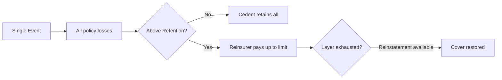

# 15.4 — Excess of Loss & Stop Loss

> **Learning Objectives**
>
> After completing this chapter you should be able to:
>
> 1. Define non-proportional reinsurance and explain excess of loss (XL).
> 2. Describe working layers, per-risk XL, and per-occurrence XL.
> 3. Explain stop loss / aggregate protection.
> 4. Calculate XL recoveries using attachment and limit.

<!-- Metadata (for RAG / AI knowledge base)
keywords: excess of loss, XL, stop loss, aggregate, attachment, limit
tags: reinsurance, XL
categories: volume-15
related: volume-15-03, volume-15-05
-->

## Executive Summary

Non-proportional reinsurance — principally **excess of loss (XL)** and **stop loss** — responds only when losses exceed a defined threshold. The reinsurer does not share every risk; it pays the amount of a loss above an attachment point, up to a limit. This structure protects the cedent against large individual losses (per risk XL), catastrophic events (cat XL), or poor aggregate experience (stop loss).

---

## 15.4.1 Non-Proportional Reinsurance

Unlike proportional reinsurance, non-proportional cover shares no part of premiums or losses by a fixed ratio. Instead:

| Element | Description |
|---------|-------------|
| **Attachment (priority)** | Loss threshold before reinsurer pays |
| **Limit (capacity)** | Maximum reinsurer pays per loss/event |
| **Recovery** | Portion of loss between attachment and limit |
| **Premium** | Usually a percentage of the cedent's subject premium |
| **Reinstatement** | Cover may be reinstated after exhaustion, for additional premium |

### Key Terminology

| Term | Definition |
|------|------------|
| **Burning cost** | Historic loss cost of the layer |
| **Rate on line** | Premium ÷ limit |
| **Risk premium** | Expected loss to the layer |
| **Exposure premium** | Premium based on portfolio characteristics |
| **Layer** | Band of protection (e.g., $5M xs $5M) |
| **Primary layer (working layer)** | Low attachment, high expected frequency |
| **Upper layers** | High attachment, low frequency |

---

## 15.4.2 Per-Risk Excess of Loss

**Per-risk XL** protects the cedent against individual large losses on specific risks.

| Element | Description |
|---------|-------------|
| Basis | Each risk / each loss separately |
| Attachment | Above cedent's retention per risk |
| Limit | Maximum recovery per risk |
| Example | $10M xs $5M — pays losses above $5M up to $15M |

### Example Calculation

| Element | Value |
|---------|-------|
| Layer | $10M xs $5M |
| Loss | $8M |
| Cedent retention | $5M |
| Reinsurer recovery | $3M |
| Remaining layer | $7M unused |

---

## 15.4.3 Per-Occurrence & Catastrophe XL

**Per-occurrence XL / CAT XL** responds to the aggregate of all losses arising from a single event.

| Element | Description |
|---------|-------------|
| Event definition | Cause(s) of loss — windstorm, earthquake, flood |
| **Hours clause** | Time window defining one occurrence |
| **Area clause** | Geographic scope of an event |
| Aggregate limit | Max recovery for the event, often with reinstatements |

### Catastrophe XL Structure

### Example — CAT XL

| Element | Value |
|---------|-------|
| Layer | $100M xs $50M (1 reinstatement) |
| Event losses | $250M |
| Cedent retention | $50M |
| Reinsurer initial payment | $100M (limit exhausted) |
| Reinstatement | Cover restored; second event up to $100M |
| Reinstatement premium | 100% of layer premium |

---

## 15.4.4 Stop Loss (Aggregate Excess)

**Stop loss** protects the cedent's aggregate loss ratio on a portfolio.

| Element | Description |
|---------|-------------|
| Attachment | Loss ratio threshold (e.g., 70%) |
| Limit | Max percentage / amount of recovery |
| Basis | Portfolio premium or incurred losses |
| Purpose | Protect against frequency deterioration |

### Stop Loss Example

| Element | Value |
|---------|-------|
| Ceded premium | $100,000,000 |
| Loss ratio attachment | 75% |
| Stop loss limit | 40 points (75% to 115%) |
| Actual loss ratio | 95% |
| Recovery | (95% − 75%) = 20 points × premium = $20M |

---

## 15.4.5 XL vs Proportional Summary

| Aspect | Proportional (QS/Surplus) | Non-Proportional (XL) |
|--------|---------------------------|------------------------|
| Premium | Shared in cession ratio | Premium paid for layer |
| Losses | Shared in cession ratio | Paid above attachment |
| Small losses | Shared | Not covered (retained) |
| Large losses | Shared | Covered up to limit |
| Administration | Bordereaux, cessions | Layer reporting, aggregations |
| Pricing | Commission-based | Burning cost / exposure |

---

## 15.4.6 Pricing an XL Layer

### Burning Cost Approach

| Step | Calculation |
|------|-------------|
| 1 | Collect historic losses |
| 2 | Trend to future values |
| 3 | Apply to current exposure |
| 4 | Reinsure to the layer |
| 5 | Derive burning cost = Expected losses ÷ Limit |
| 6 | Add loadings (expense, capital, profit) |

### Pricing Components

| Component | Description |
|-----------|-------------|
| Burning cost | Expected loss to layer |
| Risk load | Uncertainty / volatility |
| Expense load | Brokerage, administration |
| Capital charge | Return on capital |
| **Total premium** | Sum of components |
| **Rate on line** | Premium as % of limit |

---

## 15.4.7 Reinstatements

| Element | Description |
|---------|-------------|
| **Purpose** | Restore the layer after exhaustion |
| **Premium** | % of original layer premium |
| **Free reinstatement** | No additional premium (rare) |
| **Paid reinstatement** | Standard — e.g., 100% or 50% |
| **Number** | Stated in the treaty (e.g., 1, 2, or unlimited) |

---

## Review Questions

1. What does "$10M xs $5M" mean and how is a recovery calculated?
2. Distinguish per-risk XL from per-occurrence (CAT) XL.
3. What is an hours clause in a CAT treaty?
4. How does stop loss protect a portfolio?
5. What is burning cost and how is it used in XL pricing?

---

## Glossary

| Term | Definition |
|------|------------|
| Attachment | Loss threshold for reinsurer payment |
| Burning cost | Historic expected loss to a layer |
| Hours clause | Time window defining one occurrence |
| Reinstatement | Restoration of cover after exhaustion |
| Rate on line | Premium ÷ limit |

---

## Key Takeaways

1. **XL covers only losses above an attachment, up to a limit.**
2. **Per-risk XL handles individual large losses; CAT XL handles event accumulations.**
3. **Stop loss protects the aggregate loss ratio.**
4. **XL pricing relies on expected loss (burning cost) plus loadings.**

---

## References & Further Reading

- Swiss Re — Excess of loss reinsurance fundamentals
- Reinsurance Association of America — non-proportional structures
- Industry catastrophe model documentation

---

**Previous:** [15.3 Treaty — Quota Share & Surplus](03-treaty-quota-share-surplus.md) |
**Next:** [15.5 Catastrophe & Retrocession](05-catastrophe-retrocession.md)

---

*Part of the Global Insurance Underwriting Handbook — Volume 15*