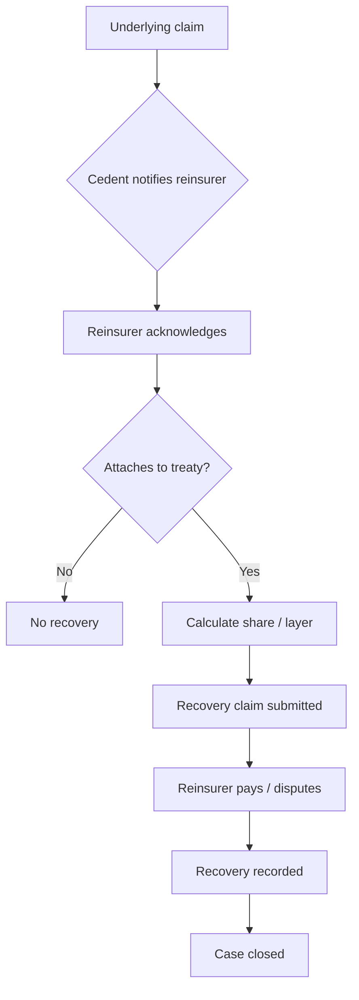

# 15.7 — Reinsurance Claims & Case Studies

> **Learning Objectives**
>
> After completing this chapter you should be able to:
>
> 1. Describe the reinsurance claims notification and recovery process.
> 2. Explain follow-the-fortunes and claims cooperation.
> 3. Calculate reinsurance recoveries for proportional and XL treaties.
> 4. Apply learning through worked case studies.

<!-- Metadata (for RAG / AI knowledge base)
keywords: reinsurance claims, recovery, follow the fortunes, notification
tags: reinsurance, claims
categories: volume-15
related: volume-07, volume-15-02, volume-15-04
-->

## Executive Summary

Reinsurance claims begin when the ceding company notifies the reinsurer of a loss that may attach to the treaty. Recoveries are calculated under the treaty terms — proportionally for quota share/surplus-based on the ceded share, or by layer for excess of loss. Key principles include follow-the-fortunes, claims cooperation, and timely notification.

---

## 15.7.1 Claims Notification

| Stage | Action |
|-------|--------|
| 1 | Cedent identifies potential reinsurance involvement |
| 2 | Notify reinsurer per treaty notice terms |
| 3 | Provide claim details, loss advice, initial reserve |
| 4 | Reinsurer acknowledges, requests information |
| 5 | Ongoing updates per reporting schedule |

### Notification Requirements

| Item | Typical Requirement |
|------|---------------------|
| Timeliness | As soon as loss known |
| Threshold | Loss above stated amount |
| Frequency | Initial, quarterly, on material change |
| Content | Policy, cause, amounts, reserves |

---

## 15.7.2 Recovery Calculation

### Proportional Treaty

| Element | Value |
|---------|-------|
| Claim | $200,000 |
| Ceded share | 40% |
| **Recovery** | **$80,000** |

### Excess of Loss

| Element | Value |
|---------|-------|
| Layer | $10M xs $5M |
| Claim | $8M |
| Cedent retention | $5M |
| **Recovery** | **$3M** |

---

## 15.7.3 Key Clauses

| Clause | Description |
|--------|-------------|
| **Follow the fortunes** | Reinsurer follows cedent's claims decisions made in good faith |
| **Follow the settlements** | Reinsurer follows cedent's settlements within terms |
| **Claims cooperation** | Both parties cooperate on significant claims |
| **Ultimate net loss (UNL)** | Loss after deductibles and other recoveries |
| **Loss adjustment expense (LAE)** | Costs of settling claims, often included in UNL |

---

## 15.7.4 Reinsurance Claims Workflow

---

## 15.7.5 Common Disputes

| Dispute | Description | Mitigation |
|---------|-------------|------------|
| Coverage wording | Ambiguity on inclusion | Clear treaty drafting |
| Aggregation | Event definition disagreement | Hours/area clauses |
| Notice failure | Late notification | Confirm notice terms |
| Reserving difference | Reserve adequacy | Consistent valuation methods |
| Allocation | Multi-year/multi-risk claims | Allocation provisions |

---

## 15.7.6 Case Studies

### Case Study 1 — Proportional Recovery

> **Scenario:** Quota share treaty 50%. Property claim of $1.2M.
>
> **Recovery:** $600,000. Cedent retains $600,000. Both share premium and losses equally.

### Case Study 2 — XL Recovery

> **Scenario:** $25M xs $10M per risk XL. Three claims: $8M, $12M, $6M.
>
> - Claim 1: $8M — below attachment, no recovery
> - Claim 2: $12M — recovery $2M
> - Claim 3: $6M — below attachment, no recovery
> - Total recoveries: $2M

### Case Study 3 — Catastrophe Event

> **Scenario:** CAT XL $100M xs $50M, 1 reinstatement at 100%. Windstorm generates $180M portfolio loss.
>
> - Retention: $50M
> - Initial recovery: $100M (layer exhausted)
> - Reinstatement premium: 100% of layer premium paid
> - Second event: another $60M → recovery $60M

---

## Review Questions

1. Describe the steps in notifying a reinsurer of a claim.
2. What is the difference between follow-the-fortunes and follow-the-settlements?
3. Calculate the recovery on a $15M claim under a $10M xs $5M layer.
4. Why are hours/area clauses important in catastrophe claims?

---

## Glossary

| Term | Definition |
|------|------------|
| Follow the fortunes | Reinsurer adopts cedent's claims decisions |
| LAE | Loss adjustment expense |
| UNL | Ultimate net loss |
| Recovery | Amount paid by reinsurer |

---

## Key Takeaways

1. **Reinsurance claims require timely notification and documentation.**
2. **Recoveries follow treaty structure — proportional share or XL layer.**
3. **Follow-the-fortunes and cooperation clauses govern cedent/reinsurer relations.**
4. **Case studies illustrate the practical application of treaties.**

---

## References & Further Reading

- Reinsurance Association of America — claims best practices
- Lloyd's claims framework materials
- Treaty wordings and market claims guides

---

**Previous:** [15.6 Pricing & Accounting](06-pricing-accounting.md)

---

*Part of the Global Insurance Underwriting Handbook — Volume 15*