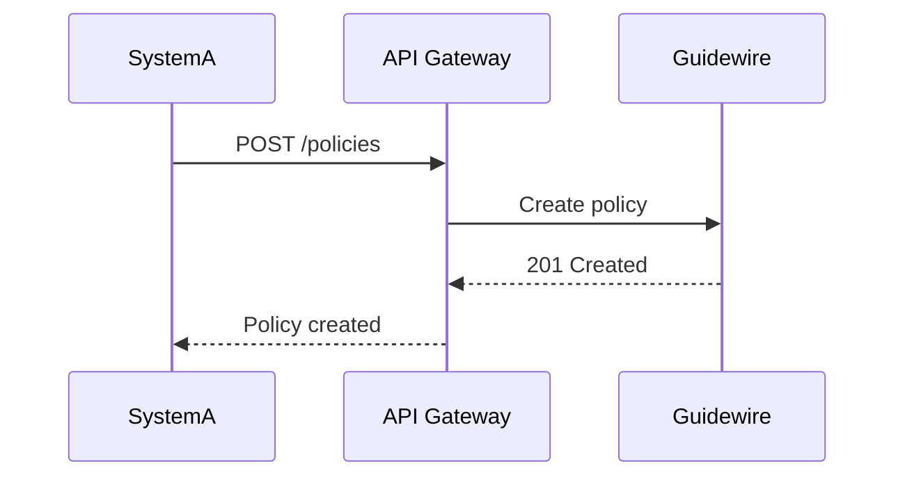

# {Integration} API Specification Template

> **Purpose:** Standard template for documenting insurance API specifications — REST/GraphQL, ACORD/JSON payloads, authentication, and integration patterns.
> **Audience:** InsurTech engineers, integration teams, BAs

---

## 1. API Overview

| Item | Value |
|------|-------|
| API name | {Name} |
| Version | {v1.0} |
| Style | {REST / GraphQL / SOAP} |
| Data standard | {ACORD / JSON / XML} |
| Authentication | {OAuth2 / API Key / mTLS} |
| Rate limit | {Requests/minute} |
| Owner | {Team} |

## 2. Endpoints

### {GET/POST/PUT/DELETE} /{path}

| Field | Value |
|-------|-------|
| Purpose | {Purpose} |
| Request body | {Schema link} |
| Response | {Schema link} |
| Error codes | {400/401/403/404/409/422/500} |

## 3. Request Payload

```json
{
  "policyNumber": "PC-000001",
  "product": "CATAuto",
  "effectiveDate": "2026-01-01",
  "insured": {
    "firstName": "John",
    "lastName": "Doe"
  }
}
```

## 4. Response Payload

```json
{
  "status": "SUCCESS",
  "premium": 1250.00,
  "policyNumber": "PC-000001"
}
```

## 5. Field Dictionary

| Field | Type | Required | Description | Validation | Example |
|-------|------|----------|-------------|------------|---------|
| {field} | {string} | Yes | {Description} | {Rule} | {Example} |

## 6. Authentication & Security

| Item | Detail |
|------|--------|
| Auth flow | {OAuth 2.0 client credentials} |
| Scopes | {policy.read, policy.write} |
| Token expiry | {3600s} |
| Transport | {HTTPS/TLS 1.2+} |
| Data residency | {Region} |

## 7. Error Handling

| Status | Code | Message | Retry |
|--------|------|---------|-------|
| 400 | INVALID_PAYLOAD | {Message} | No |
| 401 | UNAUTHORIZED | {Message} | No |
| 429 | RATE_LIMITED | {Message} | Yes — {Retry-After} |
| 500 | INTERNAL_ERROR | {Message} | Yes |

## 8. Integration Pattern (AVRO/Async)



## 9. Testing

| Test ID | Scenario | Payload | Expected |
|---------|----------|---------|----------|
| TC-{001} | {Scenario} | {Link} | {Expected} |

## 10. Versioning & Deprecation

| Version | Date | Changes | Status |
|---------|------|---------|--------|
| v1.0 | {Date} | Initial | Active |
| v1.1 | {Date} | {Changes} | Deprecating {Date} |

---

*Part of the Global Insurance Underwriting Handbook — Templates*