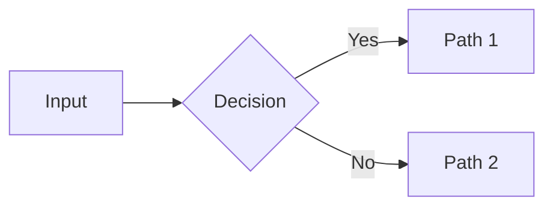

# {Chapter Number} — {Chapter Title}

> **Learning Objectives**
>
> After completing this chapter you should be able to:
>
> 1. {Objective 1}
> 2. {Objective 2}
> 3. {Objective 3}

## Executive Summary

{2–4 sentence summary of the chapter's key message and outcomes.}

<!-- Metadata (for RAG / AI knowledge base)
keywords: {keyword1, keyword2, keyword3}
tags: {tag1, tag2}
categories: {category}
related: {link1, link2}
-->

---

## {Section 1}

{Introductory paragraph.}

### Table: {Table Title}

| Column A | Column B | Column C |
|----------|----------|----------|
| {value} | {value} | {value} |

---

## {Section 2}

### Mermaid Diagram

### Example

> **Example:** {Practical example illustrating the concept.}

---

## Review Questions

1. {Question 1}
2. {Question 2}
3. {Question 3}

---

## Glossary

| Term | Definition |
|------|------------|
| {Term} | {Definition} |
| {Term} | {Definition} |

---

## Key Takeaways

1. {Takeaway 1}
2. {Takeaway 2}

---

## References & Further Reading

- {Reference 1}
- {Reference 2}

## Interview Questions

1. {Interview question 1}
2. {Interview question 2}

## Exercises

1. {Exercise 1}
2. {Exercise 2}

---

**Previous:** [{Previous Title}]({previous-file}.md) |
**Next:** [{Next Title}]({next-file}.md)

---

*Part of the Global Insurance Underwriting Handbook — {Volume / Section}*