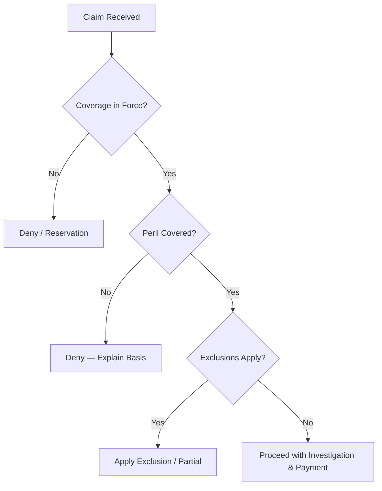

# {Line of Business} Claims Handling Guide Template

> **Learning Objectives:** After completing this guide the claims professional should be able to investigate, evaluate, and settle {Line of Business} claims in accordance with policy terms and fair claims practices.

## 1. Claims Overview

{Purpose and scope of the claims guide; key regulatory requirements.}

## 2. First Notice of Loss (FNOL)

| Element | Requirement |
|---------|-------------|
| Notification channels | Phone, web, portal, broker, email |
| Timeframe | As soon as reasonably practicable |
| Data captured | Policy number, perils, date/time, location, parties, witnesses |
| Immediate action | Acknowledge, confirm coverage, assign handler |

### FNOL Intake Checklist

- [ ] Policy number identified and verified
- [ ] Loss date within policy period
- [ ] Peril described clearly
- [ ] Contact details confirmed
- [ ] Recommendation to protect property given
- [ ] Coverage documentation advised

---

## 3. Coverage Analysis

| Step | Action |
|------|--------|
| 1 | Identify insuring agreement applicable |
| 2 | Review exclusions |
| 3 | Check conditions (notice, cooperation) |
| 4 | Verify endorsements and sublimits |
| 5 | Issue coverage position letter |

### Coverage Decision Workflow



---

## 4. Investigation Plan

### Property Claims

| Item | Action |
|------|--------|
| Site inspection | Schedule within {X} days |
| Causation | Confirm proximate cause |
| Damage assessment | Scope via adjuster / expert |
| Spoliation control | Preserve evidence |
| Witness statements | Record as needed |

### Liability Claims

| Item | Action |
|------|--------|
| Liability analysis | Establish negligent party |
| Damages verification | Obtain medical / repair records |
| Witness statements | Record promptly |
| Accident investigation | Scene, photos, police report |

---

## 5. Reserving

| Reserve Type | Definition | Timing |
|--------------|------------|--------|
| Case reserve | Specific claim estimate | At FNOL / within {X} days |
| Incurred-but-not-reported (IBNR) | Actuarial estimate | Periodic |
| Expense reserve | Defense / LAE costs | As incurred |

### Reserve Setting Factors

| Factor | Consideration |
|--------|---------------|
| Severity | Injury type, damage extent |
| Jurisdiction | Venue, comparative fault rules |
| Liability strength | Clear vs disputed |
| Policy limits | Exposure at limits |
| Trend | Inflation, medical costs |

---

## 6. Settlement & Negotiation

| Authority Level | Amount |
|------------------|--------|
| Claims Assistant | Up to ${X} |
| Claims Adjuster | Up to ${Y} |
| Senior Adjuster | Up to ${Z} |
| Litigation Manager | Above ${Z} / litigated |

### Settlement Considerations

- Policy limits and sublimits
- Comparative / contributory negligence
- Mitigation of damages
- Deductible application
- Subrogation potential
- Fraud indicators

---

## 7. Reinsurance & Contribution

| Type | Application |
|------|-------------|
| Facultative | Specific large risks pre-agreed |
| Treaty | Automatic cession within terms |
| XL | Excess of loss layer attachment |
| Contribution | Other insurance clauses |

---

## 8. Fraud Indicators in Claims

```
Red Flags:
- Delay in reporting with weak explanation
- Claimant pressure for quick settlement
- Inconsistent statements / documentation
- Recently increased coverage before loss
- Unusual timing relative to policy inception
- Medical treatment mismatched to injury
- Witnesses difficult to locate
- Prior similar claims history
```

---

## 9. Fair Claims Handling & Compliance

| Regulation | Jurisdiction | Requirement |
|------------|--------------|-------------|
| Unfair Claims Settlement Practices Act | US (state) | Prompt, fair, honest settlement |
| FCA Principles | UK | Treat customers fairly |
| IRDAI Regulations | India | Timeframe compliance |

---

## 10. Key Performance Metrics

| Metric | Definition | Target |
|--------|------------|--------|
| Cycle time | FNOL to settlement | {Target} |
| Claims paid ratio | Paid / incurred | {Target} |
| Customer satisfaction | Survey score | {Target} |
| Litigation ratio | Litigated / total | {Target} |
| Fraud referral rate | SIU referrals / claims | {Target} |

---

## 11. Case Study

> **Scenario:** {Description}
> **Analysis:** {Analysis}
> **Outcome:** {Outcome}

---

## 12. Review Questions

1. {Question}
2. {Question}

---

*Part of the Global Insurance Underwriting Handbook — Templates*