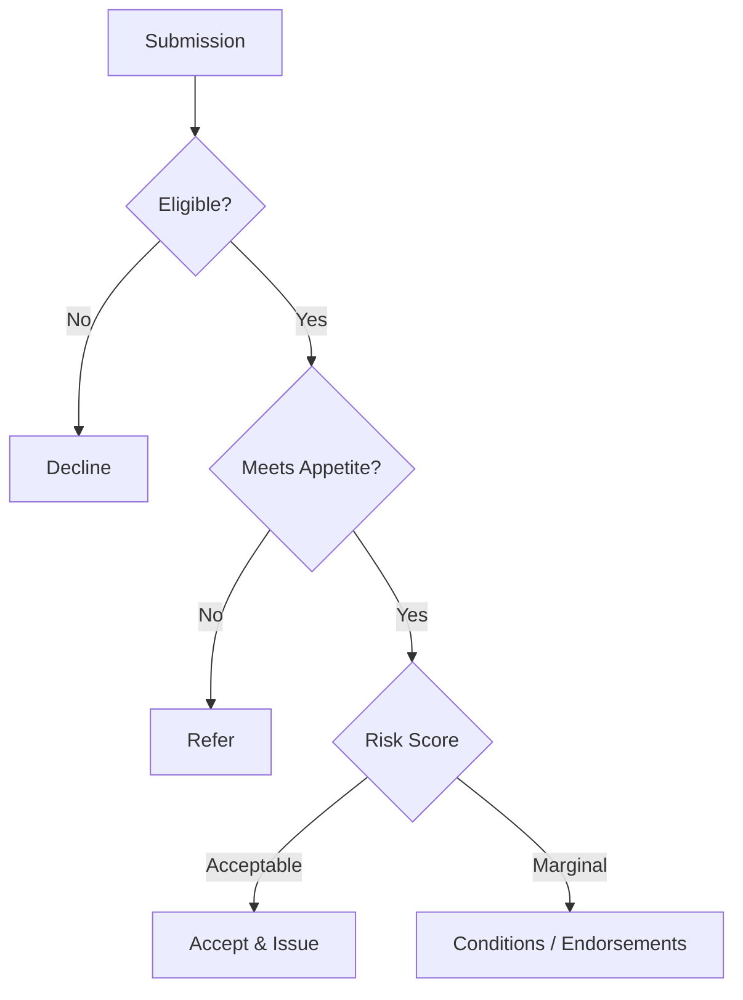
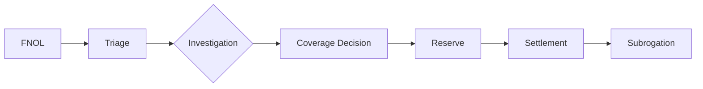

# {Product} Underwriting Guide Template

> **Learning Objectives:** After reviewing this guide the underwriter should be able to evaluate, rate, and decide {Product} risks consistently and document the decision.

## 1. Overview

{Purpose of the product, market positioning, target accounts.}

## 2. Target Customers

| Segment | Description | Appetite |
|---------|-------------|----------|
| {Segment 1} | {Description} | {Accept / Refer / Decline} |
| {Segment 2} | {Description} | {Accept / Refer / Decline} |

## 3. Coverage

{Outline of standard coverage provided.}

| Coverage | Limit | Deductible | Sublimit |
|----------|-------|-----------|----------|
| {Coverage A} | {Limit} | {Deductible} | {Sublimit} |

## 4. Eligibility Criteria

| Criterion | Requirement |
|-----------|-------------|
| {Criterion 1} | {Requirement} |
| {Criterion 2} | {Requirement} |

## 5. Risk Appetite & Classification

### Risk Classes

| Class | Description | Rating Factor |
|-------|-------------|--------------|
| Preferred | {Characteristics} | {Factor} |
| Standard | {Characteristics} | {Factor} |
| Substandard | {Characteristics} | {Factor} |

## 6. Rating Factors

| Factor | Definition | Impact |
|--------|------------|--------|
| {Factor 1} | {Definition} | {High/Medium/Low} |
| {Factor 2} | {Definition} | {High/Medium/Low} |

## 7. Underwriting Parameters

| Parameter | Minimum | Maximum | Notes |
|-----------|---------|---------|-------|
| {Parameter 1} | {Min} | {Max} | {Notes} |

## 8. Inspection Requirements

| Risk Size | Inspection Required | Type |
|-----------|-------------------|------|
| {Threshold} | Yes/No | Desk / Field / Loss Control |

## 9. Decision Rules

### Acceptance Rules

| Condition | Action |
|-----------|--------|
| {Condition} | {Action} |

### Referral Rules

| Condition | Action |
|-----------|--------|
| {Condition} | {Refer to authority level} |

### Decline Rules

| Condition | Action |
|-----------|--------|
| {Condition} | {Decline with documentation} |

## 10. Premium Calculation

**Premium = Base Rate × Exposure × Class Factor × Individual Risk Factor × State/Region Factor**

### Worked Example

| Step | Calculation | Value |
|------|-------------|-------|
| Base rate | {Rate} | ${Value} |
| Exposure | {Units} | {Value} |
| Class factor | {Factor} | {Value} |
| Risk factor | {Factor} | {Value} |
| **Total premium** | | **${Value}** |

## 11. Proposal Form

{Link to the {Product} proposal form — see proposal-forms/}

## 12. Required Documents

| Document | Required | Purpose |
|----------|----------|---------|
| {Document 1} | Yes | {Purpose} |
| {Document 2} | Yes | {Purpose} |

## 13. Claims Workflow

## 14. Fraud Indicators

| Indicator | Red Flag |
|-----------|----------|
| {Indicator 1} | {Why it matters} |
| {Indicator 2} | {Why it matters} |

## 15. Renewal & Cancellation

| Event | Notice | Process |
|-------|--------|---------|
| Renewal | {Days} | {Process} |
| Cancellation | {Days} | {Process} |

## 16. Regulations

| Regulation | Jurisdiction | Impact |
|------------|--------------|--------|
| {Regulation} | {US/UK/India} | {Impact} |

## 17. Guidewire Workflow Notes

| Process | PolicyCenter Module | Configuration |
|---------|--------------------|---------------| 
| New business | {Module} | {Config} |
| Endorsement | {Module} | {Config} |

## 18. Business Analyst Notes

{BA guidance — story context, acceptance criteria summary, integration points.}

## 19. Case Study

> **Scenario:** {Scenario description}
> **Analysis:** {Analysis}
> **Outcome:** {Outcome}

## 20. Review Questions

1. {Question}
2. {Question}

## Summary

| Key Point | Detail |
|-----------|--------|
| Appetite | {Statement} |
| Key rating factors | {Factors} |
| Referral triggers | {Triggers} |

---

*Part of the Global Insurance Underwriting Handbook — Templates*